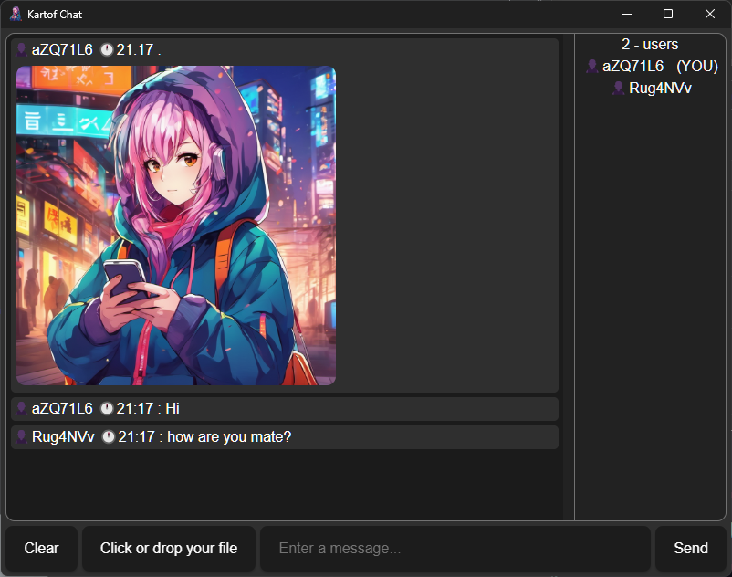

<b><h1>Kartof Chat</h1></b>

 
<b>Kartof Chat</b> is an anonymous chat platform where users can send any type of files and messages are not saved.
  
<b>Server - https://github.com/Kartofi/kartof-chat-server
 

## Recommended IDE Setup

- [VS Code](https://code.visualstudio.com/) + [Tauri](https://marketplace.visualstudio.com/items?itemName=tauri-apps.tauri-vscode) + [rust-analyzer](https://marketplace.visualstudio.com/items?itemName=rust-lang.rust-analyzer)

## Configuration

Only change the url in the src > main.rs > connect with the server's address.

## Disclaimer

<b>
I AM NOT RESPONSIBLE FOR ANY CONFIDENTIAL OR ILLEGAL DATA SEND THROUGH IT</b>
 
And this program is my first rust project so it has some bugs.
